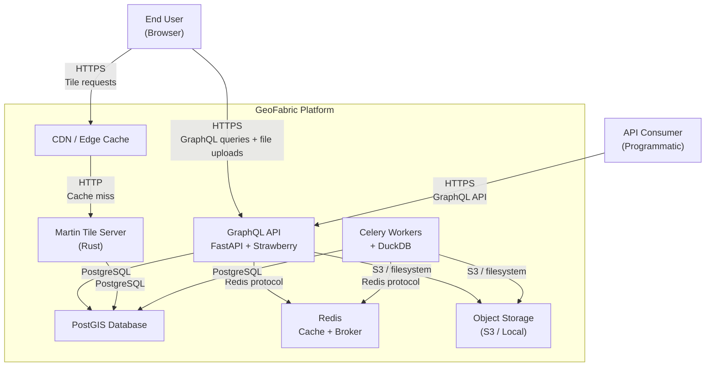
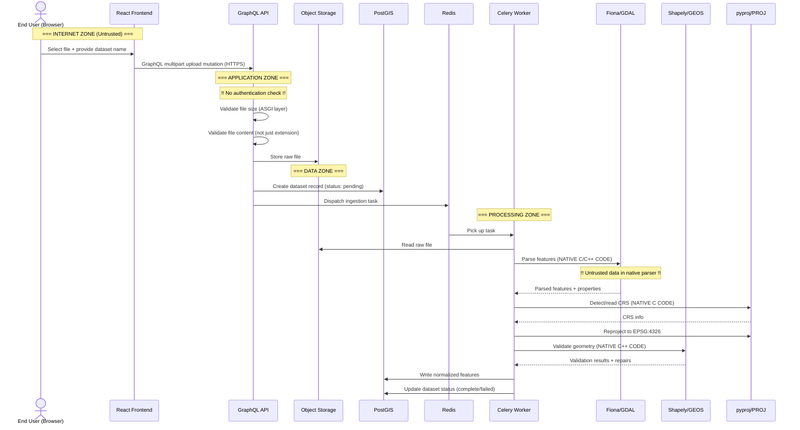

# GeoFabric Threat Model — Diagrams

Generated from consolidated CycloneDX threat model (07-consolidated.json).

---

## Diagram 1: System Context

```
 ┌─────────────────────────────────────────────────────────────────────────┐
 │                          INTERNET (Untrusted)                          │
 │                                                                         │
 │   ┌──────────────┐         ┌──────────────────┐                        │
 │   │  End User    │         │  API Consumer    │                        │
 │   │  (Browser)   │         │  (Programmatic)  │                        │
 │   └──────┬───────┘         └────────┬─────────┘                        │
 │          │ HTTPS                    │ HTTPS                            │
 └──────────┼──────────────────────────┼──────────────────────────────────┘
            │                          │
 ┌──────────┼──────────────────────────┼──────────────────────────────────┐
 │          ▼                          ▼                                   │
 │   ┌──────────────┐         ┌──────────────────┐                        │
 │   │     CDN      │         │                  │                        │
 │   │ (Tile Cache) ├────────►│   GeoFabric      │◄───────────────────┐  │
 │   └──────────────┘  HTTP   │   Platform       │  GraphQL + Upload  │  │
 │                             │                  │                    │  │
 │                             └──────────────────┘                    │  │
 │                                                                         │
 │                          GeoFabric System Boundary                      │
 └─────────────────────────────────────────────────────────────────────────┘
```

### Mermaid



---

## Diagram 2: Container/Component Architecture with Trust Boundaries

```
 ┌ ─ ─ ─ ─ ─ ─ ─ ─ ─ ─ ─ ─ ─ ─ ─ ─ ─ ─ ─ ─ ─ ─ ─ ─ ─ ─ ─ ─ ─ ─ ─ ┐
   INTERNET ZONE (Untrusted)
 │                                                                         │
    ┌──────────────────────────────────────┐
 │  │  React + TypeScript + MapLibre GL JS │                               │
    │  (Browser SPA)                       │
 │  └──────────────┬───────────────────────┘                               │
                   │ HTTPS
 └ ─ ─ ─ ─ ─ ─ ─ ─┼─ ─ ─ ─ ─ ─ ─ ─ ─ ─ ─ ─ ─ ─ ─ ─ ─ ─ ─ ─ ─ ─ ─ ─ ┘
                   │
 ┌ ─ ─ ─ ─ ─ ─ ─ ─┼─ ─ ─ ─ ─ ─ ─ ─ ─ ─ ─ ─ ┐
   EDGE ZONE       │
 │  ┌──────────────▼───────┐                   │
    │  CDN / Edge Cache    │
 │  │  (CloudFront/CF)     │                   │
    └──────────────┬───────┘
 │                 │ HTTP                       │
 └ ─ ─ ─ ─ ─ ─ ─ ─┼─ ─ ─ ─ ─ ─ ─ ─ ─ ─ ─ ─ ┘
                   │
 ┌ ─ ─ ─ ─ ─ ─ ─ ─┼─ ─ ─ ─ ─ ─ ─ ─ ─ ─ ─ ─ ─ ─ ─ ─ ─ ─ ─ ─ ─ ─ ─ ─ ┐
   APPLICATION ZONE│
 │  ┌──────────────▼───────┐    ┌───────────────────────┐                  │
    │ GraphQL API          │    │ Martin Tile Server    │
 │  │ FastAPI 0.115+       │    │ (Rust) 0.15+         │                  │
    │ Strawberry 0.250+    │    │ GET /{layer}/{z}/{x}/{y}│
 │  │ Pydantic v2          │    └───────────┬───────────┘                  │
    │ Python 3.12+         │                │
 │  └──┬──────┬────────────┘                │                              │
       │      │                             │
 └ ─ ─ ┼ ─ ─ ┼ ─ ─ ─ ─ ─ ─ ─ ─ ─ ─ ─ ─ ─ ┼ ─ ─ ─ ─ ─ ─ ─ ─ ─ ─ ─ ─ ┘
       │      │                             │
 ┌ ─ ─ ┼ ─ ─ ┼ ─ ─ ─ ─ ─ ─ ─ ─ ─ ─ ─ ─ ─ ┼ ─ ─ ─ ─ ─ ─ ─ ─ ─ ─ ─ ─ ┐
   DATA│ZONE  │                             │
 │     │      │   ┌─────────────────┐       │                              │
       │      │   │   PgBouncer     │◄──────┘
 │     │      │   │   1.23+         │                                      │
       │      │   └────────┬────────┘
 │     │      │            │                                               │
       │      │   ┌────────▼────────┐
 │     │      │   │    PostGIS      │                                      │
       │      │   │  (PostgreSQL)   │
 │     │      │   └─────────────────┘                                      │
       │      │
 │     │      │   ┌─────────────────┐    ┌──────────────────┐             │
       │      └──►│     Redis       │    │  Object Storage  │
 │     │          │  Cache + Broker │    │  (S3 / Local)    │             │
       │          └────────┬────────┘    └──────────────────┘
 │     │                   │                    ▲                           │
 └ ─ ─ ┼ ─ ─ ─ ─ ─ ─ ─ ─ ┼ ─ ─ ─ ─ ─ ─ ─ ─ ─┼─ ─ ─ ─ ─ ─ ─ ─ ─ ─ ─ ┘
       │                   │                    │
 ┌ ─ ─ ┼ ─ ─ ─ ─ ─ ─ ─ ─ ┼ ─ ─ ─ ─ ─ ─ ─ ─ ─┼─ ─ ─ ─ ─ ─ ─ ─ ─ ─ ─ ┐
   PROCESSING ZONE         │                    │
 │     │          ┌────────▼────────┐           │                          │
       └─────────►│ Celery Workers  ├───────────┘
 │                │ (Python 3.12+)  │                                      │
                  │ ┌─────────────┐ │
 │                │ │  DuckDB 1.2+│ │                                      │
                  │ │  + spatial  │ │
 │                │ └─────────────┘ │                                      │
                  │ ┌─────────────┐ │
 │                │ │Fiona(GDAL)  │ │                                      │
                  │ │Shapely(GEOS)│ │
 │                │ │pyproj(PROJ) │ │                                      │
                  │ └─────────────┘ │
 │                └─────────────────┘                                      │
 └ ─ ─ ─ ─ ─ ─ ─ ─ ─ ─ ─ ─ ─ ─ ─ ─ ─ ─ ─ ─ ─ ─ ─ ─ ─ ─ ─ ─ ─ ─ ─ ─ ┘
```

---

## Diagram 3: Data Flow Diagram — Dataset Upload and Ingestion



---

## Diagram 4: Threat-Annotated Architecture

```
 LEGEND:  !!! = Critical   !! = High   ! = Medium   ~ = Low

 ┌ ─ ─ ─ ─ ─ ─ ─ ─ ─ ─ ─ ─ ─ ─ ─ ─ ─ ─ ─ ─ ─ ─ ─ ─ ─ ─ ─ ─ ─ ┐
   INTERNET (Untrusted)
 │                                                                     │
    ┌──────────────────────────┐
 │  │  React Frontend          │  [!!CT-14] Stored XSS via properties  │
    │  MapLibre GL JS          │  [!CT-16] No CSP/CORS
 │  └──────────┬───────────────┘                                       │
               │
 └ ─ ─ ─ ─ ─ ─┼─ ─ ─ ─ ─ ─ ─ ─ ─ ─ ─ ─ ─ ─ ─ ─ ─ ─ ─ ─ ─ ─ ─ ─ ┘
               │ [!!!CT-01] No authentication on this boundary
 ┌ ─ ─ ─ ─ ─ ─┼─ ─ ─ ─ ─ ─ ─ ─ ─ ─ ─ ─ ─ ─ ─ ─ ─ ─ ─ ─ ─ ─ ─ ─ ┐
   APPLICATION │ZONE
 │             ▼                                                       │
    ┌─────────────────────────┐   ┌────────────────────────┐
 │  │  GraphQL API            │   │  Martin Tile Server    │           │
    │  [!!!CT-01] No auth     │   │  [!!CT-11] No access   │
 │  │  [!!!CT-02] No authz   │   │    control on tiles    │           │
    │  [!!CT-06] No depth lim │   └──────────┬─────────────┘
 │  │  [!!CT-07] No size lim  │              │                         │
    │  [!!CT-09] No rate lim  │              │
 │  │  [!CT-17] Introspection │              │                         │
    └──┬──────┬───────────────┘              │
 │     │      │ [!!CT-10] No TLS             │ [!!CT-10] No TLS       │
 └ ─ ─ ┼ ─ ─ ┼ ─ ─ ─ ─ ─ ─ ─ ─ ─ ─ ─ ─ ─ ─┼─ ─ ─ ─ ─ ─ ─ ─ ─ ─ ─ ┘
       │      │                              │
 ┌ ─ ─ ┼ ─ ─ ┼ ─ ─ ─ ─ ─ ─ ─ ─ ─ ─ ─ ─ ─ ─┼─ ─ ─ ─ ─ ─ ─ ─ ─ ─ ─ ┐
   DATA│ZONE  │                              │
 │     │      │   ┌─────────────────────┐    │                         │
       │      │   │  PgBouncer          │◄───┘
 │     │      │   │  [!CT-20] Pool exh. │                              │
       │      │   └────────┬────────────┘
 │     │      │            ▼                                           │
       │      │   ┌─────────────────────┐
 │     │      │   │  PostGIS            │                              │
       │      │   │  [!!CT-08] Spatial  │
 │     │      │   │    query DoS        │                              │
       │      │   │  [!CT-18] No EAR   │
 │     │      │   └─────────────────────┘                              │
       │      │
 │     │      └──►┌─────────────────────┐   ┌────────────────────┐    │
       │          │  Redis              │   │  Object Storage    │
 │     │          │  [!!CT-05] No AUTH  │   │  [!CT-18] No EAR  │    │
       │          └──────────┬──────────┘   └────────────────────┘
 │     │                     │                                         │
 └ ─ ─ ┼ ─ ─ ─ ─ ─ ─ ─ ─ ─ ┼ ─ ─ ─ ─ ─ ─ ─ ─ ─ ─ ─ ─ ─ ─ ─ ─ ─ ─ ┘
       │                     │
 ┌ ─ ─ ┼ ─ ─ ─ ─ ─ ─ ─ ─ ─ ┼ ─ ─ ─ ─ ─ ─ ─ ─ ─ ─ ─ ─ ─ ─ ─ ─ ─ ─ ┐
   PROC│ZONE                 │
 │     │          ┌──────────▼──────────┐                              │
       └─────────►│  Celery Workers     │
 │                │  [!!CT-12] Pickle   │                              │
                  │    deserialization   │
 │                │  [!!CT-03] Native   │                              │
                  │    lib exploitation  │
 │                │  [!!CT-04] Path     │                              │
                  │    traversal        │
 │                │  [!!CT-13] Zip bomb │                              │
                  │  [!CT-21] Full DB   │
 │                │    privileges       │                              │
                  └─────────────────────┘
 │                                                                     │
 └ ─ ─ ─ ─ ─ ─ ─ ─ ─ ─ ─ ─ ─ ─ ─ ─ ─ ─ ─ ─ ─ ─ ─ ─ ─ ─ ─ ─ ─ ─ ─ ┘

 THREAT SUMMARY:
 CT-01  !!! No authentication             CT-13  !! Zip bomb
 CT-02  !!! No authorization              CT-14  !! Stored XSS
 CT-03  !! Native library exploitation    CT-15  !! No audit logging
 CT-04  !! ZIP path traversal             CT-16  !  No CORS/CSP
 CT-05  !! Redis no AUTH                  CT-17  !  GraphQL introspection
 CT-06  !! GraphQL complexity abuse       CT-18  !  No encryption at rest
 CT-07  !! Unlimited upload size          CT-20  !  PgBouncer pool exhaust
 CT-08  !! Spatial query DoS              CT-21  !  Worker DB privileges
 CT-09  !! No rate limiting
 CT-10  !! No internal TLS
 CT-11  !! Martin no access control
 CT-12  !! Celery pickle RCE
```

---

## Diagram 5: Attack Surface Map

```
 ┌──────────────────────────────────────────────────────────────────────┐
 │                     GeoFabric Attack Surface                        │
 ├──────────────────────────────────────────────────────────────────────┤
 │                                                                      │
 │  ENTRY POINT                AUTH    AUTHZ    THREATS   SEVERITY      │
 │  ─────────────────────────  ──────  ───────  ────────  ──────────    │
 │                                                                      │
 │  GraphQL Mutations          NONE    NONE     7         !!!CRITICAL   │
 │   - uploadDataset                                                    │
 │   - deleteDataset                                                    │
 │   - validateDataset                                                  │
 │   - reproject, simplify                                              │
 │   - intersect, export                                                │
 │                                                                      │
 │  GraphQL Queries            NONE    NONE     4         !! HIGH       │
 │   - datasets (list all)                                              │
 │   - features (paginated)                                             │
 │   - spatialIntersection                                              │
 │   - jobStatus                                                        │
 │                                                                      │
 │  GraphQL Introspection      NONE    NONE     1         !  MEDIUM     │
 │   - __schema                                                         │
 │   - __type                                                           │
 │                                                                      │
 │  Tile REST Endpoint         NONE    NONE     3         !! HIGH       │
 │   - GET /{layer}/{z}/{x}/{y}                                         │
 │   (via CDN -> Martin)                                                │
 │                                                                      │
 │  File Upload (multipart)    NONE    NONE     5         !!!CRITICAL   │
 │   - GeoJSON                                                          │
 │   - Shapefile (ZIP)                                                  │
 │   - GeoParquet                                                       │
 │   - WKT                                                              │
 │                                                                      │
 │  Redis (Internal)           NONE    NONE     3         !! HIGH       │
 │   - Cache operations                                                 │
 │   - Celery broker                                                    │
 │                                                                      │
 │  PostgreSQL (Internal)      Password (assumed) Grants  2  ! MEDIUM   │
 │   - Via PgBouncer                                                    │
 │                                                                      │
 │  Object Storage (Internal)  IAM/keys (assumed) Bucket  1  ! MEDIUM   │
 │   - Raw file read/write                                              │
 │                                                                      │
 └──────────────────────────────────────────────────────────────────────┘

 TOTAL: 26 threats across 8 entry points
 CRITICAL entry points: File Upload (untrusted binary + no auth)
                        GraphQL Mutations (state-changing + no auth)
```

---

## Diagram 6: Risk Heat Map

```
              IMPACT
              Low      Medium     High       Critical
           ┌──────────┬──────────┬──────────┬──────────┐
  High     │          │ CT-25    │ CT-06    │ CT-01    │
           │          │          │ CT-07    │ CT-02    │
           │          │          │ CT-09    │          │
 LIKELI-   │          │          │ CT-15    │          │
 HOOD      ├──────────┼──────────┼──────────┼──────────┤
  Medium   │          │ CT-16    │ CT-04    │ CT-03    │
           │          │ CT-17    │ CT-05    │          │
           │          │ CT-20    │ CT-08    │          │
           │          │ CT-23    │ CT-11    │          │
           │          │ CT-24    │ CT-12    │          │
           │          │          │ CT-13    │          │
           │          │          │ CT-14    │          │
           ├──────────┼──────────┼──────────┼──────────┤
  Low      │          │ CT-26    │ CT-10    │ CT-03    │
           │          │          │ CT-18    │          │
           │          │          │ CT-19    │          │
           │          │          │ CT-21    │          │
           │          │          │ CT-22    │          │
           └──────────┴──────────┴──────────┴──────────┘

  !!! CRITICAL RISK (top-right): CT-01, CT-02
  !!  HIGH RISK (right columns, high likelihood): CT-03, CT-06, CT-07, CT-09
```
