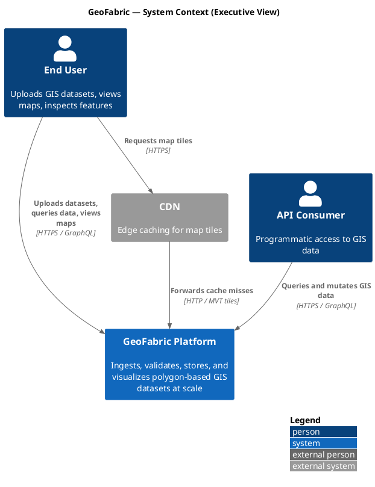
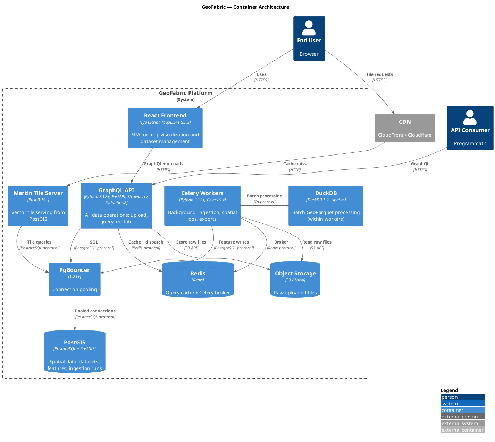
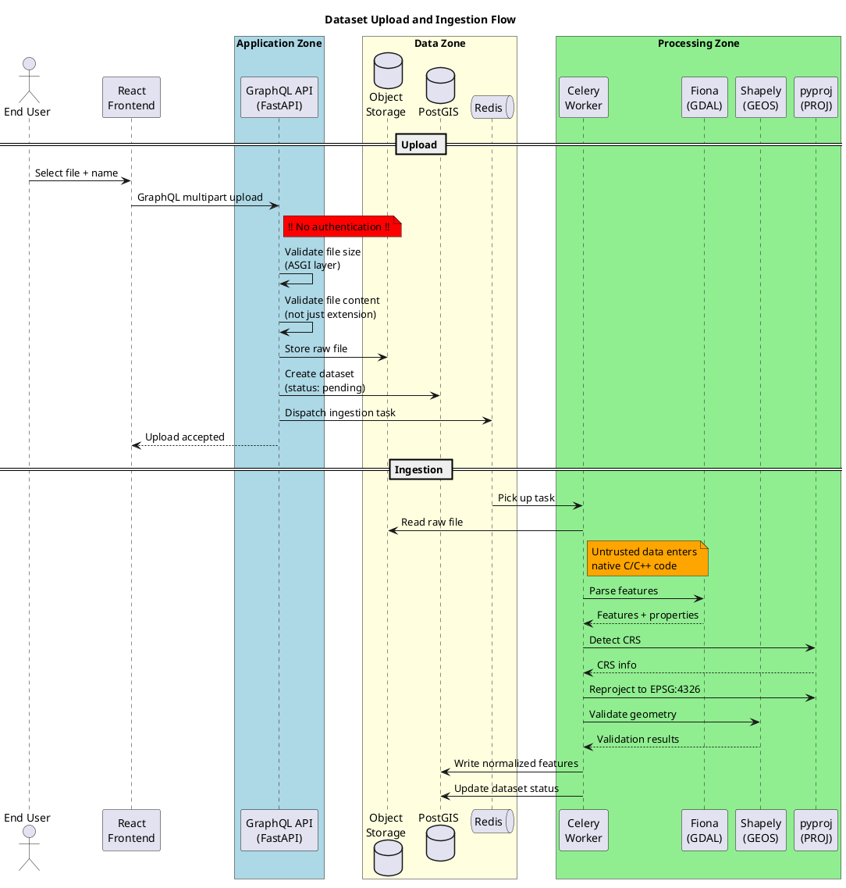
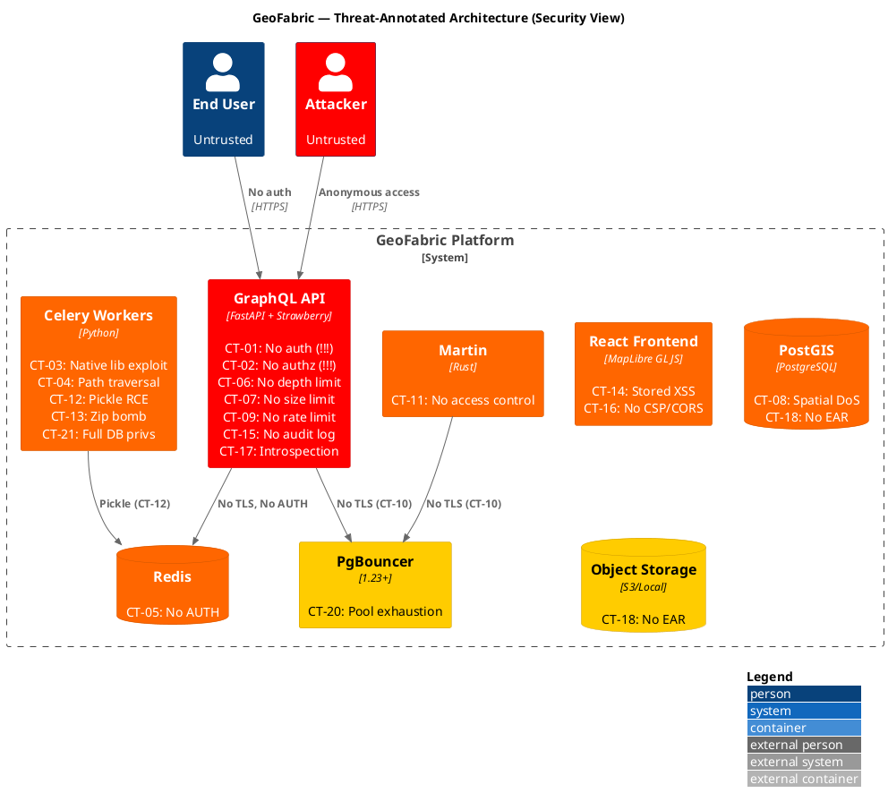
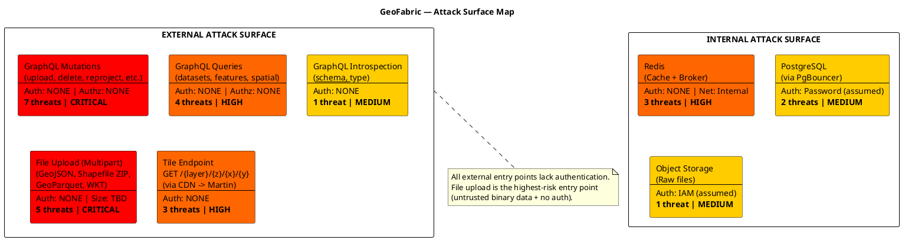

# GeoFabric Threat Model — Visual Design (PlantUML)

---

## Figure 1: System Context (C4 — Executive View)

---

## Figure 2: Container Architecture (C4)

---

## Figure 3: Data Flow — Upload and Ingestion (Sequence)

---

## Figure 4: Threat-Annotated Architecture (C4 — Security View)

---

## Figure 5: Attack Surface Map (PlantUML)

---

## Diagram Legend

| Symbol | Meaning |
|---|---|
| Red background (#FF0000) | Critical severity — requires immediate remediation |
| Orange background (#FF6600) | High severity — address before production deployment |
| Yellow background (#FFCC00) | Medium severity — address in short-term roadmap |
| Dashed border | Trust boundary |
| Bold connection label | Sensitive data flow |
| !!! prefix | Critical threat |
| !! prefix | High threat |
| ! prefix | Medium threat |
